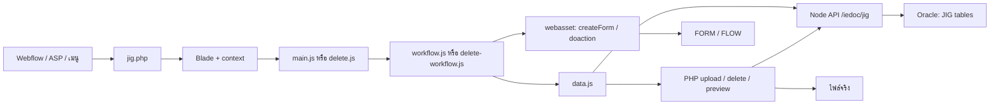

# คู่มือดูแลโปรแกรม JIG

ตรวจจาก source ณ 1 ตุลาคม 2026 บนฐาน commit `95da783d` รวม working tree ในขณะตรวจ เอกสารนี้อธิบายพฤติกรรมที่พบใน code ไม่ใช่การยืนยันผลทดสอบระบบจริงหรือ schema ใน Oracle ที่ deploy อยู่

## อ่านเอกสารอย่างไร

- เริ่มจากหน้านี้: โครงสร้างโปรแกรม เงื่อนไข และตัวอย่างข้อมูล
- [Function reference](FUNCTION_REFERENCE.md): หน้าที่และผลลัพธ์ของฟังก์ชันใน PHP/JavaScript ของ Form
- [Maintenance และรายการที่อาจนำออกได้](MAINTENANCE.md): จุดแก้ไข อาการผิดพลาด และผลตรวจการเรียกใช้

ขอบเขตหลักคือ Create / Inspection / Approve JIG และ Request Delete JIG ในโปรเจกต์ `form` ส่วน Node.js API อธิบายเป็น integration contract และชี้ตำแหน่ง source สำหรับตามต่อ ไม่มี Dashboard implementation ในโฟลเดอร์ `assets/script/ieform/IE-JIG` ชุดนี้

## 1. โครงสร้างและหน้าที่ไฟล์

ทุก path ด้านล่างเริ่มจาก root ของโปรเจกต์ `form`

| ไฟล์ | หน้าที่ |
|---|---|
| `application/controllers/ieform/IE-JIG/jig.php` | รับ URL/context ของ Webflow เลือกหน้า กำหนด mode ตรวจสิทธิ์งานไฟล์ และจัดการไฟล์จริง |
| `application/views/ieform/IE-JIG/request_form.blade.php` | HTML/CSS ของ JIG, ชื่อ input, maxlength, required, Check Points, NG Detail และ approval controls |
| `application/views/ieform/IE-JIG/approve_form.blade.php` | หน้าเข้าใช้งาน Approve ที่นำโครง Form มาใช้ร่วมกัน |
| `application/views/ieform/IE-JIG/delete_form.blade.php` | หน้า Delete JIG ทั้ง Create/View/Approve โทนแดง แสดงข้อมูล Master และเหตุผลการลบ |
| `application/views/ieform/IE-JIG/main.blade.php` | โครง view เก่า มีเพียง form context; ไม่พบการเลือกใช้ใน JIG controller ปัจจุบัน |
| `assets/script/ieform/IE-JIG/main.js` | จัดการ DOM, dropdown, employee lookup, validation, Check Points, NG, ไฟล์ และ hydrate หน้า JIG |
| `assets/script/ieform/IE-JIG/workflow.js` | ประสาน createForm, upload, บันทึก JIG, Approve/Return, requester-flow และ finish |
| `assets/script/ieform/IE-JIG/data.js` | HTTP adapter ของ JIG/Delete JIG และ URL preview/download/PDF |
| `assets/script/ieform/IE-JIG/payload.js` | แปลงชื่อ input เป็น API fields, วันที่ และ ACTION |
| `assets/script/ieform/IE-JIG/checkpoint.js` | กฎ MIN/MAX/Measured → OK/NG |
| `assets/script/ieform/IE-JIG/revision.js` | ตรวจความเปลี่ยนแปลง Check Points และคำนวณ REV ฝั่งหน้า |
| `assets/script/ieform/IE-JIG/delete.js` | UI, loading, validation, payload และไฟล์ของ Delete JIG |
| `assets/script/ieform/IE-JIG/delete-workflow.js` | Create/Approve/Return/Reject และ recovery ของ Delete JIG |
| `assets/script/ieform/entry.js` | ลงทะเบียน bundle `iejig` และ `iejigDelete` |
| `assets/dist/js/iejig.js`, `assets/dist/js/iejigDelete.js` | ผล build ที่ browser ใช้ ไม่ควรแก้ business logic ในไฟล์เหล่านี้โดยตรง |
| `rspack.config.js` | รวบรวม entry และ build assets |

ส่วนที่ใช้ร่วมกับโปรแกรมอื่น: `MY_Controller`, traits `_Form`/`_File`, `form_model`, `@amec/webasset/form` และ employee/fetch utilities อย่าเปลี่ยน shared code เพื่อแก้เฉพาะ JIG โดยไม่ตรวจผลกระทบ



## 2. การเปิดหน้าและ Key

JIG ปกติใช้ `ieform/IE-JIG/jig` หรือ `show_create_jig_form` ส่วน Delete ใช้ `ieform/IE-JIG/jig/show_create_delete_form` การตั้ง VFORMPAGE ใน Master ภายนอกต้องตรงกับ controller จริง

| Query | Field | ตัวอย่าง |
|---|---|---|
| `no` | NFRMNO | 31 |
| `orgNo` | VORGNO | `051401` |
| `y` | CYEAR | `26` |
| `y2` | CYEAR2 | `2026` |
| `runNo` | NRUNNO | 4 |
| `empno` | actor/context | `05023` |

ห้า Key หลักคือ NFRMNO/VORGNO/CYEAR/CYEAR2/NRUNNO ต้องใช้ครบเมื่ออ่านหรือแก้ฟอร์มเดิม อย่าตัดเลขศูนย์นำหน้าของ VORGNO/EMPNO ค่า empno ใน URL ไม่ใช่การสร้าง login session

ตัวอย่าง Create: `.../jig?no=31&orgNo=051401&y=26&empno=05023`

ตัวอย่างฟอร์มเดิม: `.../jig?no=31&orgNo=051401&y=26&y2=2026&runNo=4&empno=05023`

Delete Create ต้องมี `jigno` เพื่อเลือก Master; เมื่อมี runNo แล้วใช้ JIG_NO จากข้อมูล Delete Form ที่ API คืนมา

`show_jig_form()` รับ `ref_cyear2`/`ref_nrunno` แล้ว map เป็น y2/runNo ส่วน `open_from_asp()` รับ parameter ตาม route แล้ว redirect ด้วย query ที่ encode แล้ว ไม่มี logic ใน JIG ที่อ่าน `sr`; ความหมายในระบบ ASP ต้องตรวจระบบนั้นเพิ่มเติม

## 3. Mode และปุ่ม

| กรณี | แก้ไขข้อมูล | ปุ่ม/Remark |
|---|---|---|
| ยังไม่มี NRUNNO | Create | บันทึก/Send Form ตามหน้าที่เปิด |
| mode=2, CSTEPNO=`--` | Requester แก้ข้อมูลที่อนุญาต | Approve; ตรวจข้อมูลเหมือน Create |
| mode=2, CSTEPNO อื่น | อ่านข้อมูล กรอก Remark ได้ | JIG: Approve/Return; Delete: เพิ่ม Reject |
| mode อื่น เช่น 3 | View only | ไม่แสดงปุ่มอนุมัติ |

Input By, Requested By, Form No, Jig No, Revision และ Start Use เป็นข้อมูลที่ระบบควบคุมในหน้าฟอร์มเดิม PIC แก้ได้ใน Requester ไม่ใช่ทุก Approver; Reg. Date ไม่ได้แสดงเป็นช่องกรอกในหน้า JIG ปัจจุบัน

Return ต้องมี Remark และใช้ Swal แจ้งเตือน; Approve ไม่บังคับ Remark; Delete Reject บังคับ Remark ด้วย

หลัง JIG Approve ขั้น `07` ใช้ reload หน้าเดิม ขั้นอื่นใช้ `redirectWebflow()` ส่วน Delete workflow ใช้ redirect หลัง action/callback สำเร็จ

## 4. เส้นทางบันทึกและอนุมัติ

### Create JIG

1. รอ dropdown/employee พร้อม แล้ว validate Form, Check Points และไฟล์
2. ใช้ `createForm()` จาก webasset สร้าง FORM/FLOW ก่อน
3. เก็บห้า Key ใน sessionStorage เพื่อ recovery และตรวจ VINPUTER/VREQNO ผ่าน `getFormDetail()`
4. Upload ไฟล์จริงผ่าน PHP ได้ metadata กลับมา
5. POST `/iedoc/jig` ส่ง header, DETAILS, FILES และ NG ให้ API บันทึก JIG_FORM และตารางลูก
6. แสดง `บันทึกข้อมูล JIGNO : ... เรียบร้อย` จากเลขที่บันทึกจริง แล้วกลับหน้า Create ที่ยังไม่มี y2/runNo

JIG_NO ที่สร้างอัตโนมัติออกโดย API ไม่ใช่ JS รูปแบบ `J26-006` (`J` + ปี ค.ศ. สองหลัก + `-` + running สามหลัก) ใน `jig.repository.ts` → `createForm()` ใช้ปีปัจจุบัน timezone Asia/Bangkok แล้วหาเลขสูงสุดจาก JIG_MASTER และ JIG_FORM ด้วย pattern เช่น `^J26-[0-9]{3}$` ก่อนเพิ่มหนึ่งและเติมศูนย์ให้ครบสามหลัก หากเกิน 999 จะปฏิเสธรายการ มี transaction และ lock JIG_FORM ระหว่างสร้างเลข

ตัวอย่าง Master มี J26-001 ถึง J26-003 และ Form มี J26-003 ถึง J26-005 → Create ใหม่ได้ `J26-006` ข้อมูลรูปแบบเก่า `JIG26-005` ไม่เข้า pattern นี้ จึงไม่นำมานับ running ของ J26

ข้อจำกัด: API สร้างเลขอัตโนมัติเฉพาะเมื่อไม่ได้ส่ง JIG_NO มา หน้า Create ปัจจุบันไม่ส่ง field นี้ แต่ caller อื่นที่ส่ง JIG_NO เองจะข้ามส่วนสร้างเลข จึงต้องตรวจ caller/validation เพิ่มหากต้องการบังคับรูปแบบทุกช่องทาง ส่วน `IE-JIG26-000004` เป็นชื่อ folder/เลขฟอร์มคนละอย่างกับ JIG_NO ไม่ต้องเปลี่ยนตาม

### Requester Approve JIG

`act('approve')` → validate → ยืนยัน → `persist()` → PATCH Form → POST requester-flow → `startJigForm()` → `doaction()` → อ่าน FORM.CST → ถ้า CST=2 POST finish

- `persist()` หมายถึงบันทึกข้อมูล Form/ไฟล์ ไม่ได้หมายถึง Approve
- requester-flow ปรับ Flow ตาม NG ล่าสุด ส่ง PICCODE ของ Location เมื่อมี NG; API เป็นผู้ตัดสินเพิ่ม/ลบ/แก้ step 07
- `start_request` ใน PHP ปัจจุบันตรวจสิทธิ์ ไม่ใช่คำสั่ง UPDATE CST; การเดินสถานะ Flow ใช้ doaction
- ถ้า finish ล้มเหลวหลัง doaction สำเร็จ จะแสดงปุ่มลองอัปเดต Master อีกครั้ง โดยไม่เรียก doaction ซ้ำ
- FORM/FLOW, ไฟล์จริง และ JIG API เป็นหลาย request จึงไม่ใช่ transaction เดียวครอบคลุมทั้งหมด

### Delete JIG

Create Form/Flow → upload → POST delete-forms → Master สถานะ PENDING_DELETE → แสดงฟอร์มที่สร้างแล้ว

Requester แก้ reason/detail/ไฟล์และ Approve ได้ ส่วนข้อมูล Master เป็นรายละเอียดอ้างอิง; เมื่อจบอนุมัติอ่าน CST แล้ว `/finish` ทำ Master เป็น DELETED เมื่อ Reject และ CST=3 ใช้ `/reject` คืนเป็น ACTIVE ไม่ใช่การลบแถว Master จริง

Delete ใช้ JIG_FORM_FILE ร่วมกับ JIG โดยแยกห้า Key และ directory prefix หน้า Delete อ่าน Check Points/Defect จาก Master ปัจจุบัน ไม่ใช่ historical snapshot ของรายการเหล่านั้นใน Delete Form

## 5. Validation และข้อมูลที่แสดง

| Input | API field / กฎที่พบในหน้า |
|---|---|
| jig_name | JIG_NAME; required, maxlength 200 |
| drawing_no | DWG; ไม่ required, maxlength 100 |
| revision | REV; hidden value `0` แสดง `*` |
| process_code | PROCESS_CODE; required, PROCESS เป็นทั้ง value/label เรียงตัวอักษร |
| itemno | ITEMNO; required, maxlength 4 |
| location | LOCATION ของ Header; SHOPCODE เป็น value, SHOPCODE-SHOPDESC เป็น label |
| pic_empno | PIC_EMPNO; IE PIC API, เรียง SNAME, label `(SEMPNO) SNAME` |
| desc | JIG_DESC; maxlength 100; ปัจจุบันไม่ได้ส่ง PARTS |
| maker | MAKER; maxlength 100 |
| start_use_date | START_USE_DATE; Create วันแรกของเดือนปัจจุบัน, display dd/mm/yyyy |
| qty | JIG_QTY; required, integer 1–99999 |
| price | PRICE; integer 0–9999999999; หน่วยบาท |
| period | INSPEC_PERIOD; required, 6 หรือ 12 |
| requested_by | ตรวจ active employee; maxlength 5; ไม่บังคับเป็นตัวเลขล้วน |

ข้อสังเกต: PIC มีเครื่องหมาย * ใน Blade แต่ select ปัจจุบันไม่มี attribute `required` อย่าถือว่าเครื่องหมาย * ทำให้ validation บังคับอัตโนมัติ ดูรายละเอียดใน Maintenance

ค่าความยาวในเอกสารนี้มาจาก UI ไม่ใช่การตรวจ schema Oracle จริง ต้องรักษา UI, DTO และ database ให้ตรงกัน

### Check Points

อย่างน้อยหนึ่งแถว เพิ่มได้ไม่จำกัดจาก UI ชื่อจุดตรวจต้องมี; point/tool/unit จำกัด 200/100/20 ตัวอักษร Numeric inputs step 0.0001 ช่วง ±99999999.9999

- เปลี่ยน MIN/MAX → ล้าง Measured ของแถวนั้น
- กรอก Measured ก่อน MIN/MAX → Swal เตือน
- MIN > MAX หรือค่าที่ไม่ใช่ finite number → invalid
- MIN ≤ Measured ≤ MAX → OK; นอกช่วง → NG พร้อมพื้นหลังแดงอ่อน
- `MIN=-0.1, MAX=0.1, MEASURED_VALUE=0.05` → OK; `0.15` → NG
- อย่าใช้ parseInt กับค่าทศนิยม และอย่าแปลงช่องว่างเป็น 0 ก่อน validate

### NG

มี NG อย่างน้อยหนึ่งแถวจึงเปิดโซน NG และบังคับ Defect Detail (500), ACTION อย่างน้อยหนึ่งตัวเลือก, CORRECTIVE (100), PLAN_DATE

ACTION เป็น comma-separated เช่น `Adjust,Modify,Replace`; hydrate กลับเป็น checkbox จาก whitelist ไม่ใช่ข้อความ CORRECTIVE

Location ใช้ของ Header ครั้งเดียว; **ห้ามส่ง LOCATION เข้า NG** เพราะ JIG_FORM_NG/JIG_DEFECT_NG ไม่มี column นี้แล้ว PICCODE ส่งระดับเดียวกับ NG สำหรับ Flow

ผู้ดูฟอร์มที่มี NG ใช้ปุ่ม PDF ได้ ไม่จำเป็นต้องอยู่ mode=2 ปุ่มเปิด endpoint `/forms/{ห้า Key}/ng-tag.pdf`; PDF ถูกสร้างโดย backend

### Revision ของ INSPECTION

ทำงานเมื่อ FORM_TYPE=INSPECTION, mode=2, CSTEPNO=`--` เท่านั้น

เปรียบเทียบ CHECK_POINT, INSPECTION_TOOL, MIN, MAX, MEASURED_VALUE, UNIT รวมการเพิ่ม/ลบแถว เมื่อเปลี่ยนและ REV=REV_OLD เพิ่มหนึ่งขั้น ถ้า REV≠REV_OLD ไม่เพิ่มซ้ำ

ตัวอย่าง REV_OLD=A, REV=A แก้ Measured → REV=B; Return แล้วแก้อีก → ยัง B ค่า `0` แสดง `*`; ลำดับ 0→A→B→…→Z→AA

รายละเอียด implementation ที่ต้องรู้: baseline ฝั่ง JS คือ snapshot.DETAILS ที่โหลดเข้าหน้านั้น ไม่ได้ query JIG_CHECKPOINT มาเทียบเอง; เปรียบเทียบตามลำดับแถว; ตัวเลข 0.10 กับ 0.1 ถือว่าเท่ากัน; เมื่อเพิ่ม REV แล้วในรอบหน้านั้น การแก้กลับค่าเดิมไม่ได้ลด REV อัตโนมัติ

ค่า REV ถูกส่งตอน PATCH ของ Inspection Requester ส่วน Master อัปเดตเมื่อ finish ตรวจ API เพิ่มทุกครั้งที่แก้กฎ REV เพราะการแสดงผลฝั่ง JS ไม่ใช่ข้อรับประกันของค่าที่ backend บันทึก

## 6. ตัวอย่าง payload

ตัวอย่างสมมติสำหรับอธิบายโครงสร้าง ไม่ใช่ request ที่ให้ยิง production:

```json
{
  "NFRMNO": 31, "VORGNO": "051401", "CYEAR": "26", "CYEAR2": "2026", "NRUNNO": 4,
  "FORM_TYPE": "CREATE", "CREATE_BY": "05023",
  "JIG_NAME": "Sample fixture", "DWG": null, "REV": "0",
  "ITEMNO": "183", "JIG_DESC": "Fixture for inspection", "MAKER": "Sample maker",
  "PROCESS_CODE": "H3RB03", "LOCATION": "B1", "PIC_EMPNO": "05023",
  "START_USE_DATE": "2026-10-01", "JIG_QTY": 1, "PRICE": 4390, "INSPEC_PERIOD": 12,
  "DETAILS": [{"CHECK_SEQ": 1, "CHECK_POINT": "X axis", "INSPECTION_TOOL": "Water Level", "MIN": -0.1, "MAX": 0.1, "MEASURED_VALUE": 0.15, "UNIT": "mm"}],
  "FILES": [{"FILE_SEQ": 1, "FILE_NAME": "color.png", "FILE_PATH": "IE-JIG26-000004/color.png", "FILE_TYPE": "image/png", "FILE_SIZE": 1024}],
  "PICCODE": "14077",
  "NG": {"DEFECT_DETAIL": "X axis เกิน MAX", "ACTION": "Adjust,Modify", "CORRECTIVE": "ปรับตั้งและตรวจซ้ำ", "PLAN_DATE": "2026-10-15"}
}
```

FILES ต้องใช้ metadata จริงจาก upload ห้ามประกอบ path เองตามตัวอย่าง ถ้าไม่มี NG จะส่ง `NG: null` และไม่ใส่ PICCODE ใน payload ที่ collector สร้าง

ผลลัพธ์เชิงพฤติกรรม: FORM/FLOW มีเลขฟอร์ม, JIG API เก็บ header/detail/file/NG, หน้าแจ้งเลข JIG_NO ที่ API คืน และ reset Create ส่วน Master ยังรอ approval completion

## 7. ไฟล์แนบ

- JIG ต้องมีอย่างน้อย 1 ไฟล์; Delete ปัจจุบันไม่บังคับขั้นต่ำ ทั้งสอง UI จำกัดรวม 5 ไฟล์ ไฟล์ละ 10 MB, JPG/PNG/PDF
- Root มาจาก `$this->upload_path` โดยแยก production/development
- directory JIG: `IE-JIG26-000004`; Delete: `IE-DELJIG26-000004` ใช้ CYEAR2 สองตัวท้ายและ NRUNNO หกหลัก
- ชื่อไฟล์ sanitize ตัด space/อักขระที่ไม่อนุญาต ไม่เติม hash ยาว; ชื่อที่บันทึกจริงกับ metadata ต้องตรงกัน
- ชื่อซ้ำและเนื้อหาเดิมนำกลับมาใช้ได้ ชื่อซ้ำแต่เนื้อหาต่างถูกปฏิเสธ ไม่ overwrite เงียบ ๆ
- ลบไฟล์ต้องยืนยัน; PHP เรียก API ลบ metadata ก่อน แล้วลบไฟล์จริง ถ้าลบไฟล์จริงไม่สำเร็จจะมี warning แยก
- การลบไม่ได้เป็น transaction เดียวระหว่าง filesystem กับ Oracle อาจมี orphan file ต้องตรวจเมื่อได้รับ warning

## 8. API ที่ Frontend เรียก

Base `/iedoc/jig`; `{key}` คือ NFRMNO/VORGNO/CYEAR/CYEAR2/NRUNNO ตามลำดับ

| Method / Path | ใช้ทำอะไร |
|---|---|
| GET mfg-processes / locations / ie-pics | dropdown |
| POST base | สร้างข้อมูล JIG Form หลัง createForm |
| GET, PATCH forms/{key} | โหลด/แก้ snapshot |
| POST forms/{key}/requester-flow | จัด Flow ตาม NG/PICCODE ก่อน requester approve |
| POST forms/{key}/finish | ประมวลผลเข้า Master หลังตรวจ CST |
| GET forms/{key}/ng-tag.pdf | สร้าง NG Tag PDF |
| DELETE forms/{key}/files/{seq} | PHP ใช้ลบ metadata JIG |
| GET {jigNo}, {jigNo}/checkpoints, {jigNo}/defect-ng | รายละเอียด Master สำหรับ Delete |
| POST delete-forms | สร้าง Delete request |
| GET, PATCH delete-forms/{key} | โหลด/แก้ Delete request |
| POST delete-forms/{key}/finish หรือ /reject | เปลี่ยน Master หลัง approval/rejection |
| DELETE delete-forms/{key}/files/{seq} | PHP ใช้ลบ metadata Delete |

Backend อยู่ `D:/for_dev/src/api/src/iedoc/jig`: controller กำหนด routes, service ประสานงาน, repository จัดการ DB/transaction, dto ตรวจรูปแบบข้อมูล, jig-inspection.service ดูแล auto inspection, jig-ng-tag.service ดูแล PDF การไม่มี caller ในหน้า Form ไม่ได้แปลว่า backend endpoint นั้นเลิกใช้ เพราะอาจมี Dashboard/Job/ระบบภายนอกเรียก
