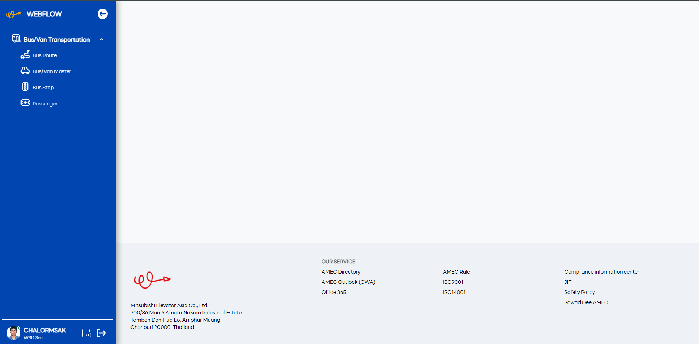
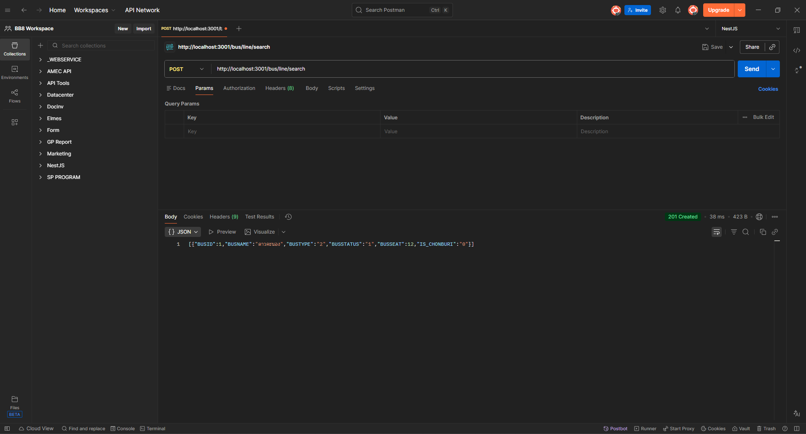
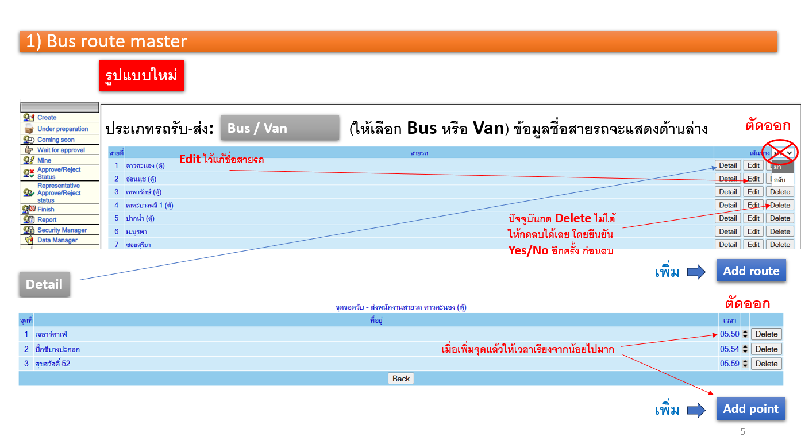

# Arranging Bus/Van Transportation

> **👋 Purpose**
>
> - GP Dept เพิ่ม/ลบ/แก้ไขชื่อสายรถและจุดรถได้
> - โปรแกรมสามารถเพิ่มข้อมูลตั้งต้นในการจัดรถในแต่ละวันได้
> - GP Dept สามารถแก้ไขจุดจอดของพนักงานในแต่ละวันได้

---

## How to run project

- ขอให้ Prject นี้แยกส่วน Front End และ Back end ออกจากกัน โดย Back end จะไปรันที่ API Project (NestJS)
- Fontend ขอให้มีการจัดการผ่าน Javascript ทั้งการ Render ข้อมูล และการรับส่งข้อมูล
- Function พื้นฐานเช่น Alert/ShowMessage/Datatable/Select2 ขอให้เรียกใช้จาก @amec/webassets
- Test บน Local ต้อง pull branch BUS จาก form กับ pull branch main จาก api
- api: cd เข้าไปที่โปรเจคแล้วรัน npm run start:dev
- form: cd เข้าไปที่โปรเจคแล้วรัน npm run watch
- เข้า url http://localhost:8080/form/authen/index/1

    

- Test API ใช้โปรแกรม Postman หรือที่ถนัดได้เลย

    

---

## To do List

**6/3/2026**

- [x] Map Master สายรถและจุดจอดจากระบบเดิม
- [x] Map รายชื่อพนักงานกับจุดจอด
- [x] **Job** สำหรับสร้างขข้อมูลตั้งต้นการจัดรถในแต่ละวัน
- [ ] วันศุกร์โปรแกรมจะรันส่วนของวันเสาร์ + วันอาทิตย์ด้วย
- [ ] เปลี่ยนสายรถก่อนแจ้งพนักงาน (GP Workflow)
- [ ] GP Dept ส่ง E-mail แจ้งพนักงานได้ + มีไฟล์รายชื่อแนบใน Email ด้วย

**5/2/2026**

- ออกแบบหน้าจอสำหรับการจัดการสายรถให้สามารถแก้ไข เพิ่มจุด ลดจุดได้ และเรียกใช้ API **_(ไม่เรียกข้อมูลด้วย PHP นะครับ)_**

---

## Data Structure

---

**Table** : BUS_LINE

**Description** : Master สายรถรับส่ง

| Column      | Description                                         | Type   |
| ----------- | --------------------------------------------------- | ------ |
| BUSID       | รหัสสายรถ (Auto Generate)                           | Number |
| BUSNAME     | ชื่อสายรถ                                           | Text   |
| BUSTYPE     | ประเภทรถ(1: รถบัส/ 2: รถตู้)                        | Text   |
| BUSSTATUS   | สถานะสายรถ (1: ใช้งานอยู่/ 0: ไม่ใช้แล้ว)           | Text   |
| BUSSEAT     | จำนวนที่นั่งสูงสุดของสายนั้น                        | Number |
| IS_CHONBURI | เป็นสายรถในจังหวัดชลบุรีหรือไม่ (1: ใช่/ 0: ไม่ใช่) | Text   |

---

\
**Table** : BUS_STOP

**Description** : Master จุดจอดรถรับส่ง

| Column         | Description                                  | Type   |
| -------------- | -------------------------------------------- | ------ |
| STOP_ID        | รหัสจุดจอดรถ (Auto Generate)                 | Number |
| STOP_NAME      | ชื่อจุดจอดรถ                                 | Text   |
| STOP_STATUS    | สถานะจุดจอดรถ (1: ใช้งานอยู่/ 0: ไม่ใช้แล้ว) | Text   |
| WORKDAY_TIMEIN | เวลาเข้าจอดวันทำงานกะเช้า                    | Text   |
| NIGHT_TIMEIN   | เวลาเข้าจอดกะกลางคืน                         | Text   |
| HOLIDAY_TIMEIN | เวลาเข้าจอดวันหยุด                           | Text   |

---

\
**Table** : BUS_ROUTE\
**Description** : Master สายรถรับส่ง
| Column | Description | Type |
| --- | --- | --- |
| BUSLINE | สายรถรับส่ง | Number |
| STOPNO | จุดจอดรถรับส่ง | Number |
| NEXTSTOP | จุดจอดรถรับส่งถัดไป | Number |
| STATENO | ขาไป (1)/ขากลับ (2) | Number |
| IS_START | จุดเริ่มต้นสาย (1: ใช่/ 0: ไม่ใช่) | Text |

---

\
**Table** : BUS_PASSENGER \
**Description** : Master จุดจอดรถรับส่งของพนักงาน
| Column | Description | Type |
| --- | --- | --- |
| EMPNO | รหัสพนักงาน | Text |
| BUSSTOP | จุดจอดรถ | Number |
| UPDATE_DATE | วันที่ Update | Text |
| UPDATE_BY | รหัสพนักงานคนที่ Update | Text |

---

**Table** : BUS_DISPATCH_HEAD
**Description** : เก็บข้อมูลหัวเอกสารการจัดรถประจำวัน / OT
| Column | Description | Type |
|---|---|---|
| DISPATCH_ID | รหัสเอกสารการจัดรถ | Number |
| DISPATCH_DATE | วันที่จัดรถ | Date |
| DISPATCH_TYPE | ประเภทการจัดรถ (W=workday, O=OT) | Text |
| STATUS | สถานะเอกสาร (D=Draft, S=Saved, C=Closed) | Text |
| UPDATE_BY | รหัสพนักงานผู้แก้ไขล่าสุด | Text |
| UPDATE_DATE | วันที่แก้ไขล่าสุด | Date |
| SHIFT | กะการเดินรถ (D=Day, N=Night, H=Holiday) | Text |

**Table** : BUS_DISPATCH_LINE  
**Description** : เก็บข้อมูลสายรถที่ถูกนำมาใช้ในเอกสารจัดรถแต่ละใบ
| Column | Description | Type |
|---|---|---|
| DISPATCH_ID | รหัสเอกสารการจัดรถ | Number |
| BUSID | รหัสสายรถอ้างอิงจาก master | Number |
| BUSNAME | ชื่อสายรถ | Text |
| BUSTYPE | ประเภทรถ | Text |
| BUSSEAT | จำนวนที่นั่งของรถ | Number |
| LINE_STATUS | สถานะของสายรถในเอกสาร | Text |

**Table** : BUS_DISPATCH_STOP  
**Description** : เก็บข้อมูลจุดจอดของแต่ละสายรถในเอกสารจัดรถ
| Column | Description | Type |
|---|---|---|
| DISPATCH_ID | รหัสเอกสารการจัดรถ | Number |
| LINE_ID | รหัสสายรถ (BUS_DISPATCH_LINE.BUSID) | Number |
| STOP_ID | รหัสจุดจอด | Number |
| STOP_NAME | ชื่อจุดจอด | Text |
| PLAN_TIME | เวลาตามแผนของจุดจอด (รูปแบบ HHMM) | Text |

**Table** : BUS_DISPATCH_PASSENGER  
**Description** : เก็บข้อมูลพนักงานที่ขึ้นรถในจุดจอดของเอกสารจัดรถ
| Column | Description | Type |
|---|---|---|
| DISPATCH_ID | รหัสเอกสารการจัดรถ | Number |
| STOP_ID | รหัสจุดจอด | Number |
| EMPNO | รหัสพนักงาน | Text |

---

### API ที่สามารถเรียกใช้งานได้

| ✅  | End point             | Method | Description                        |
| --- | --------------------- | ------ | ---------------------------------- |
| ✅  | /bus/line/search      | POST   | ดึงขัอมูลสายรถทั้งหมด              |
| ✅  | /bus/line/create      | POST   | สร้างขัอมูลสายรถ                   |
| ✅  | /bus/line/update      | POST   | แก้ไขขัอมูลสายรถ                   |
| ✅  | /bus/line/delete      | POST   | ลบขัอมูลสายรถ                      |
| ✅  | /bus/stop/search      | POST   | ดึงขัอมูลจุดจอดรถทั้งหมด           |
| ✅  | /bus/stop/create      | POST   | สร้างขัอมูลจุดจอดรถ                |
| ✅  | /bus/stop/update      | POST   | แก้ไขขัอมูลจุดจอดรถ                |
| ✅  | /bus/stop/delete      | POST   | ลบขัอมูลจุดจอดรถ                   |
| ✅  | /bus/route/search     | POST   | ดึงขัอมูลเส้นทางรถทั้งหมด          |
| ✅  | /bus/route/create     | POST   | สร้างขัอมูลเส้นทางรถทั้งหมด        |
| ✅  | /bus/route/update     | POST   | แก้ไขขัอมูลเส้นทางรถทั้งหมด        |
| ✅  | /bus/route/delete     | POST   | ลบขัอมูลเส้นทางรถทั้งหมด           |
| 🔃  | /bus/passenger/search | POST   | ดึงขัอมูลจุดจอดรถของพนักงานทั้งหมด |
| 🔃  | /bus/passenger/create | POST   | สร้างขัอมูลจุดจอดรถของพนักงาน      |
| 🔃  | /bus/passenger/update | POST   | แก้ไขขัอมูลจุดจอดรถของพนักงาน      |
