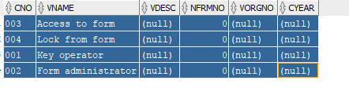

FORMAUTH CNO CHAR 3 1
FORMAUTH VNAME VARCHAR2 30 2
FORMAUTH VDESC VARCHAR2 256 3
FORMAUTH NFRMNO NUMBER 22 4
FORMAUTH VORGNO VARCHAR2 6 5
FORMAUTH CYEAR CHAR 2 6

003 Access to form 0
004 Lock from form 0
001 Key operator 0
002 Form administrator 0

